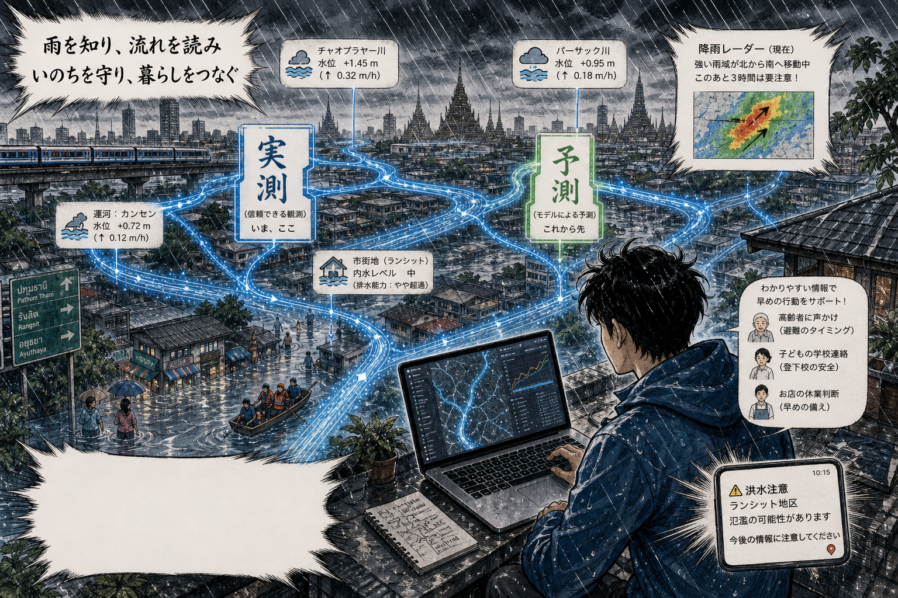
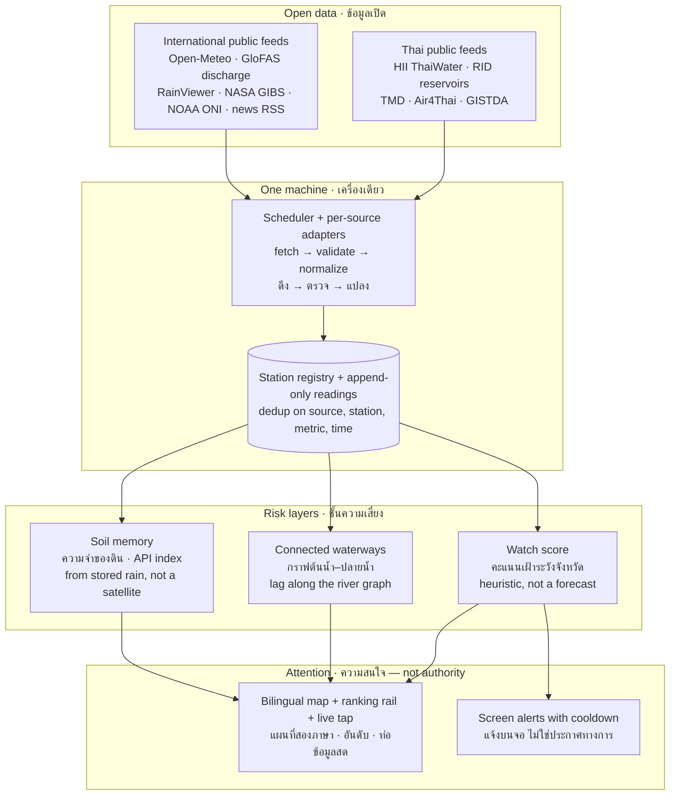

  

  <em>รู้ฝน อ่านทางน้ำ รักษาชีวิต เชื่อมโยงวิถีชีวิต 
  Know the rain, read the flow, protect lives, connect livelihoods.</em>

<h1 align="center">FLOODDASH BLUEPRINT</h1>

<b>พิมพ์เขียว ไม่ใช่ซอร์สโค้ด · The blueprint, not the source code.</b>

  Public method for a private twin called <b>FloodDash</b>. 
  Fork the method, not the secrets. Reconstruct from this repo — not from the running building.

---

## What this is / นี่คืออะไร

**TH.** ที่นี่คือ **พิมพ์เขียวสาธารณะ** ของระบบเฝ้าระวังน้ำท่วมที่สร้างขึ้นหลังน้ำท่วมหาดใหญ่ปลายปี 2568 — สถาปัตยกรรม สูตร แหล่งข้อมูลเปิด ปรัชญาการออกแบบสองภาษา และแผนสร้างทีละขั้น **ไม่มีซอร์สโค้ดของระบบที่รันจริง** คู่แฝดส่วนตัวชื่อ **FloodDash** ไม่ได้อยู่ใน repository นี้ เว็บ [flood.nonarkara.org](https://flood.nonarkara.org) เป็นภาพประกอบของสิ่งที่พิมพ์เขียวนี้ชี้ไป ไม่ใช่คลังซอร์ส และไม่ใช่คำเชิญให้ขูดหรือถอดแบบอาคารที่กำลังใช้งาน

**EN.** This repository is the **public blueprint** of a flood-watch system built after the Hat Yai floods of late 2025 — architecture, formulas, open data sources, a bilingual design language, and a phased build-your-own roadmap. **There is no production source here.** The private twin is **FloodDash**. The site [flood.nonarkara.org](https://flood.nonarkara.org) is an *illustration* of where this method can land, not a source tree, and not an invitation to scrape or reverse-engineer the running building.

| | Public blueprint / พิมพ์เขียวสาธารณะ | Private twin / คู่แฝดส่วนตัว |
|---|---|---|
| Name | **FloodDash-Blueprint** (this repo) | **FloodDash** |
| What you get | Ideas, formulas, catalogs, roadmap | The running implementation |
| Licence | [CC BY 4.0](LICENSE) on these documents | Separately © — not distributed here |
| How to rebuild | From the files in `docs/` | You don't. Fork the *method*. |

Studio tenets this repo is written to keep:

1. **Fork the method, not the secrets.** / **สืบทอดวิธี ไม่ใช่ความลับ**
2. **One Mac.** A single machine that stays awake is enough. / **เครื่องเดียว**
3. **Bilingual TH/EN**, as signage, not as an afterthought. / **สองภาษาเป็นป้าย ไม่ใช่ปุ่มสลับทีหลัง**
4. **Measured vs modelled honesty.** Live readings and model output must never wear the same badge. / **ซื่อสัตย์ระหว่างของที่วัดได้ กับของที่จำลอง**
5. **Reconstruct from the blueprint, not the running building.** / **สร้างใหม่จากพิมพ์เขียว ไม่ใช่จากอาคารที่กำลังใช้งาน**

**One paragraph, the idea itself / แนวคิดในหนึ่งย่อหน้า**

**TH.** ระบบเดียว เครื่องเดียว รันได้ตลอด 24 ชั่วโมง ดึงข้อมูลเปิดของรัฐและนานาชาติเก้าท่อ (ระดับน้ำ ฝน เขื่อน อ่างเก็บน้ำ อากาศ พยากรณ์ อัตราการไหลแม่น้ำ ดัชนีมหาสมุทร ข่าว) เก็บทุกค่าลงฐานข้อมูลเดียว คำนวณ **คะแนนเฝ้าระวังรายจังหวัด** และ **กราฟต้นน้ำ–ปลายน้ำ** ที่บอกว่าฝนบนภูเขาวันนี้จะกลายเป็นแรงกดที่ปลายน้ำในอีกกี่วัน แสดงผลสองภาษาบนแผนที่เดียว ไม่มีการพยากรณ์ปลอม ไม่มีตัวเลขที่ตรวจสอบย้อนกลับไม่ได้ ทุกอย่างมาจากข้อมูลจริง — หรือช่องว่างที่บอกตรง ๆ ว่ายังไม่มีข้อมูล

**EN.** One machine, running 24/7, pulling nine free public data pipelines (water level, rain, dams, reservoirs, air quality, forecast, river discharge, ocean state, news) into one database. It computes a **province watch score** and a **connected-waterways cascade** — how many days it takes for rain on a mountain today to become pressure downstream. Bilingual, one map, no fabricated forecasts, every number traceable to a real reading. If a station is silent, the screen says so.

This repo is **not source code**, **not an official flood forecast**, and **not a closed club**. If you build a version, send a link; it can be listed here.

---

## Philosophy invitation / คำเชิญเปิด

**ภาษาไทย.** ผมสร้าง FloodDash หลังน้ำท่วมหาดใหญ่ปลายปี 2568 เพราะข้อมูลน้ำท่วมของไทยทั้งหมด — ระดับน้ำ สสน. ฝนสะสม เขื่อน อ่างเก็บน้ำ คุณภาพอากาศ พยากรณ์ฝน อัตราการไหลแม่น้ำ ดัชนีมหาสมุทร ข่าวน้ำท่วม — เป็น **ข้อมูลเปิด ฟรี และเครื่องอ่านได้อยู่แล้ว** สิ่งที่ขาดไม่ใช่ข้อมูล แต่คือคนที่จะนั่งเชื่อมมันเข้าด้วยกันให้เป็นภาพเดียว

ผมตั้งใจ **ไม่แจกซอร์สโค้ด** ของเวอร์ชันที่ใช้งานจริงในตอนนี้ — ไม่ใช่เพราะหวง แต่เพราะอยากรู้ว่า **มีกี่ทีมที่จะสร้างระบบที่ดีเท่ากันหรือดีกว่าได้ด้วยตัวเอง** โดยเริ่มจากแนวคิดเดียวกัน ข้อมูลเดียวกัน และแรงบันดาลใจเดียวกัน เอกสารนี้บอกทุกอย่างที่ต้องรู้: สถาปัตยกรรม สูตรคำนวณ แหล่งข้อมูลทุกจุด ปรัชญาการออกแบบ และแผนการสร้างทีละขั้น — สิ่งที่ขาดมีแค่เวลาของคุณ

พิมพ์เขียวนี้เดิมพันว่าวิธีคิดส่งต่อได้ ความลับของระบบที่รันอยู่ไม่จำเป็นต้องส่งต่อ คู่แฝดส่วนตัวชื่อ FloodDash ยังเป็นของส่วนตัว อาคารที่ [flood.nonarkara.org](https://flood.nonarkara.org) มีไว้ให้ดูว่าวิธีนี้หน้าตาเป็นอย่างไร ไม่มีไว้ให้รื้อผนังหาแบบก่อสร้าง

ถ้าคุณสร้างเวอร์ชันของตัวเองได้ — จังหวัด เทศบาล มหาวิทยาลัย บริษัท หรือแค่มือสมัครเล่นที่อยากช่วยประเทศ — บอกผมด้วย ผมอยากเห็น จะได้ดีใจที่มันได้ผล

**English.** I built FloodDash after the Hat Yai floods of late 2025, because every piece of flood data Thailand needs — HII water levels, rain accumulation, dams, reservoirs, air quality, rain forecasts, river discharge, the ocean's ENSO state, flood news — is **already free, open, and machine-readable**. The missing piece was never the data. It was someone willing to sit down and wire it into one coherent picture.

I'm deliberately **not handing out the source code** for the version running today. Not out of possessiveness — out of curiosity. **I want to know how many teams can build something this good, or better, on their own**, starting from the same ideas, the same free data, and the same motivation. This repository tells you everything else: the architecture, the formulas, every data source, the design philosophy, and a phased build-your-own roadmap. The only thing missing is your time.

The bet is that **method travels; secrets do not need to.** The private twin stays private. The building at [flood.nonarkara.org](https://flood.nonarkara.org) is there so you can see what the method looks like in weather — not so you can peel the plaster off and call it a blueprint.

If you build your own version — a province, a municipality, a university, a company, or just someone who wants to help the country — tell me. I want to see it work.

**— Dr Non Arkaraprasertkul** (ดร.นน อัครประเสริฐกุล), Senior Expert, Smart City Promotion Department, Digital Economy Promotion Agency (depa), Kingdom of Thailand.

---

## Ethical use / การใช้ตามจริยธรรม

**TH.** เครื่องมือแบบนี้อยู่ใกล้ความปลอดภัยของคน ไม่ใช่แค่ความสวยของแดชบอร์ด อ่านสี่ข้อนี้ก่อน fork

**EN.** A tool like this sits next to people's safety, not next to a design awards list. Read these four before you fork.

### 1. Do not scrape the running building / อย่ารื้ออาคารที่กำลังใช้งาน

**TH.** อย่าขูด อย่าถอดแบบ อย่าพยายามดึงซอร์สจาก [flood.nonarkara.org](https://flood.nonarkara.org) — ไม่ใช่ CDN ของพิมพ์เขียวนี้ ซอร์สของ FloodDash ส่วนตัวไม่ได้อยู่ที่นั่น วิธีสร้างอยู่ที่ไฟล์ใน `docs/` ของ repository นี้ ถ้าคุณต้องเปิด DevTools ของเว็บจริงเพื่อ “ได้โค้ด” คุณกำลังทำผิดโจทย์

**EN.** Do not scrape, harvest, or reverse-engineer [flood.nonarkara.org](https://flood.nonarkara.org) for source. That site is not this blueprint's CDN. The private FloodDash source is not there. The method is in the files under `docs/`. If you need the live site's DevTools to “get the code,” you are solving the wrong problem.

### 2. Do not pretend the private twin is open / อย่าแสร้งว่า FloodDash ส่วนตัวเป็นโอเพนซอร์ส

**TH.** Repository นี้เป็น CC BY 4.0 **เฉพาะเอกสาร** ไม่ได้ให้สิทธิ์ในตัวระบบ FloodDash ที่รันอยู่ การอ้างว่า “FloodDash เป็นโอเพนซอร์สเพราะมี blueprint” เป็นการพูดเท็จ สิ่งที่เปิดคือวิธี สิ่งที่ปิดคืออาคาร

**EN.** This repository's [CC BY 4.0](LICENSE) covers **these documents**, not the running FloodDash implementation. Saying “FloodDash is open source because a blueprint exists” is false. The method is public. The building is not.

### 3. Protect people, not just dashboards / รักษาคน ไม่ใช่แค่หน้าจอ

**TH.** อัปไทม์มีค่าก็ต่อเมื่อคนยังถูกบอกความจริง คะแนนเฝ้าระวังในพิมพ์เขียวนี้เป็น **ตัวชี้วัดเชิงประเมินจากข้อมูลสด — ไม่ใช่ประกาศเตือนภัยทางการ** ทุกหน้าจอ ทุกแชท ทุกรายงาน ควรติดป้ายนั้น ฟัง ปภ. / กรมอุตุฯ / สทนช. เสมอเมื่อเป็นเรื่องอพยพและความปลอดภัย แดชบอร์ดที่ดูแน่ใจแต่ปิดช่องว่างข้อมูล เป็นอันตรายกว่าแดชบอร์ดที่ว่างและซื่อสัตย์

**EN.** Uptime only matters if people are still told the truth. Every watch score in this blueprint is a **heuristic from live observations — not an official warning.** Label it that way on every screen, every chat answer, every export. Official evacuation and safety calls belong to DDPM / TMD / ONWR. A dashboard that looks certain while hiding a gap is more dangerous than a blank panel that says `no data since 14:32`.

### 4. Measured is not modelled / ของที่วัดได้ ไม่ใช่ของที่จำลอง

**TH.** ค่าสถานีที่มาถึงตอนนี้ (วัดจริง · 実測) กับค่าจากแบบจำลองหรือพยากรณ์ (จำลอง · 予測) ต้องแยกสี แยกป้าย แยกประโยค ห้ามสังเคราะห์ตัวเลขเมื่อสถานีเงียบ ห้ามให้โมเดลภาษา “ช่วยเติม” ระดับน้ำ ห้ามนำดัชนีฤดูกาลอย่าง ENSO มาพูดราวกับพยากรณ์วันอังคารหน้า

**EN.** A live gauge reading and a model or forecast must never wear the same badge, the same colour, or the same sentence. Do not invent a number when a station is quiet. Do not let a language model “helpfully fill in” a water level. Do not talk about a seasonal index such as ENSO as if it were next Tuesday.

Full framing: [`docs/07-honest-limitations.md`](docs/07-honest-limitations.md).

---

## How the system works / ระบบทำงานอย่างไร

**TH.** แพทเทิร์นไม่ผูกภาษา ไม่ผูกคลาวด์ ไม่ผูกคลัสเตอร์: ข้อมูลเปิดเข้ามา → ชั้นความเสี่ยงที่อธิบายได้ → สัญญาณความสนใจบนหน้าจอ (ไม่ใช่ประกาศเตือนภัยแทนหน่วยงาน)

**EN.** The pattern is stack-agnostic, cloud-optional, cluster-free: open data in → explainable risk layers → attention on a screen (not a substitute for official warnings).

Five modules, one process — detail in [`docs/02-architecture.md`](docs/02-architecture.md):

| Module / โมดูล | Job / หน้าที่ |
|---|---|
| **Scheduler** | One jittered timer per source; isolated failure; exponential backoff; a visible health lamp per pipe |
| **Adapters** | One small module per feed: fetch → validate → store. Filter sentinels like `-1`, reject stale dam rows, coerce types |
| **Database** | Station registry + append-only readings; uniqueness on `(source, station, metric, time)` so retries are idempotent |
| **Risk engine** | Recompute watch score, cascade, and soil wetness from stored readings — formulas you can write on a whiteboard |
| **Presentation** | Fixed-viewport bilingual UI; optional local-LLM chat that may only speak numbers the database already has |

**Measured vs modelled, on purpose / แยกของวัดกับของจำลองตั้งใจ**

| Layer / ชั้น | Kind / ชนิด | Source in this blueprint |
|---|---|---|
| Water level, rain, dams, reservoirs, AQI | **Measured** · ค่าวัด | HII, RID, PCD, TMD observations — [`docs/03-data-sources.md`](docs/03-data-sources.md) |
| Watch score, rise rate, soil wetness (Antecedent Precipitation Index) | **Derived from measured** · คำนวณจากของวัด | [`docs/04-the-science.md`](docs/04-the-science.md) |
| NWP / Open-Meteo rain, GloFAS discharge, RainViewer nowcast | **Modelled** · แบบจำลอง | same catalog; must be labelled as forecast or model |
| ENSO / ONI | **Seasonal prior** · ปัจจัยก่อนเหตุ | NOAA ONI — shifts a season, says nothing about a Tuesday |
| Screen alert | **Attention** · ความสนใจ | threshold + cooldown — [`docs/06-build-your-own-roadmap.md`](docs/06-build-your-own-roadmap.md) Phase 4; not DDPM/TMD/ONWR |

The reference pattern's alerts are **on-screen**. Pushing warnings onto phones is a different, higher-stakes undertaking — see [`docs/deep-dive/07-alert-systems.md`](docs/deep-dive/07-alert-systems.md) if you go there, and still do not replace official channels.

---

## Build your own from these files / สร้างของคุณเองจากไฟล์เหล่านี้

**TH.** ไม่มีโค้ดให้คัดลอก มีลำดับอ่านและลำดับสร้าง ทำตามเฟส อย่าข้ามไปทำแผนที่ก่อนท่อข้อมูลพิสูจน์แล้ว

**EN.** There is no code to copy. There is a reading order and a build order. Follow the phases. Do not draw a map before one pipeline has proven it can store real rows without duplicates.

### Reading order / ลำดับอ่าน

| # | File | What to take from it / สิ่งที่ควรได้จากไฟล์ |
|---|---|---|
| 1 | [`docs/01-why-and-what.md`](docs/01-why-and-what.md) | The gap is integration, not sensors. Three rules: one machine, real data or nothing, every number explainable |
| 2 | [`docs/02-architecture.md`](docs/02-architecture.md) | The five-module shape: scheduler, adapters, single-file DB, in-process event bus, bilingual UI |
| 3 | [`docs/03-data-sources.md`](docs/03-data-sources.md) | The free catalog (Thai + international), cadences, and field-tested gotchas |
| 4 | [`docs/04-the-science.md`](docs/04-the-science.md) | Watch-score shape, Chao Phraya-style cascade, Antecedent Precipitation Index, rise rate |
| 5 | [`docs/05-design-language.md`](docs/05-design-language.md) | Permanent TH+EN signage vs toggle-driven content; colour; fixed viewport |
| 6 | [`docs/06-build-your-own-roadmap.md`](docs/06-build-your-own-roadmap.md) | Phases 0–5, stack-agnostic, with effort notes |
| 7 | [`docs/07-honest-limitations.md`](docs/07-honest-limitations.md) | What this pattern cannot do, and the ethical floor |
| 8 | [`docs/08-lessons-from-production.md`](docs/08-lessons-from-production.md) | What broke in weather: tunnel hostnames (`api-` vs `api2-`), backup paths, irreplaceable SQLite, Pages proxy, embeddings, one-Mac ops |
| 9 | [`docs/09-compute-and-data.md`](docs/09-compute-and-data.md) | Compute kit: sizing, cadence, **public URLs with attribution**, schema concepts, named env vars (no values), blank-Mac checklist |

**After the seven core files:** read **8** before you expose a public URL, and **9** before you size a disk or copy an env name. They are the production lessons and the compute kit. They still contain **no secrets** and **no private source**.

Want more depth after that? The **[deep-dive reference](docs/deep-dive/README.md)** is eight original bilingual synthesis documents (Thai flood context, endpoint-level sources, hydrological models, ML, risk-scoring theory, open-source tool registry, alert systems, roadmap economics). It is a cited summary, not a copy of any single source paper.

### Build order / ลำดับสร้าง

Work the phases in [`docs/06-build-your-own-roadmap.md`](docs/06-build-your-own-roadmap.md). The table below is a navigator, not a substitute.

| Phase | Done when / เสร็จเมื่อ | Build with / สร้างจาก |
|---|---|---|
| **0** One pipeline, end to end | Two poll cycles add real timestamps and **zero duplicate rows**. No UI yet | §2.3 uniqueness constraint · start with a national water-level feed from §3.1 |
| **1** Every source, health-checked | The process runs overnight unattended; each pipe has last-success time and backoff | §2.1–2.2 · every row in [`docs/03-data-sources.md`](docs/03-data-sources.md) you actually need |
| **2** Score, map, live tap | A non-technical person can see *where to look first* on a phone in sunlight | §4.1 formula · §2.4 event bus · §5 design language |
| **3** Waterways + soil memory | The map is no longer “dots”; it knows upstream today vs downstream in *n* days | §4.2 cascade + GloFAS · §4.3 API from *your* stored rain |
| **4** Trust features | Alerts cooldown; methodology is searchable in both languages; any chat speaks only DB numbers | §4 + [`docs/07-honest-limitations.md`](docs/07-honest-limitations.md) |
| **5** Operate like it matters | Installed as a 24/7 service, crash-restart, log rotation, soak-tested a week | §2.3 retention · a dashboard that dies in a flood has negative value |

Two developers, Phases 0–5 in order, is estimated in the roadmap at **roughly 8–12 weeks** for a useful, honest, 24/7-operable system — a fraction of a commercial procurement, with every on-screen number your own team can explain. Pick any language your team already knows. The blueprint is the pattern, not a stack.

### Concrete first slice / ชิ้นแรกที่จับต้องได้

1. Pick **one** public feed from [`docs/03-data-sources.md`](docs/03-data-sources.md) (HII water level is the richest starting signal).
2. Fetch → validate (dates, types, sentinels such as `-1`) → insert-or-ignore into a readings table keyed as in [`docs/02-architecture.md`](docs/02-architecture.md) §2.3.
3. Query “rows now vs five minutes ago.” If that count grows cleanly twice, Phase 0 is done.
4. Only then clone the adapter pattern for the other pipes you need. Then — and only then — put §4.1 on a map.
5. Env **names** (never values) and a blank-Mac order of operations: [`docs/09-compute-and-data.md`](docs/09-compute-and-data.md) §9.7–9.8.

### What you will not find here / สิ่งที่จะไม่พบที่นี่

- Production source, keys, tokens, or machine configs
- A claim that this blueprint *is* FloodDash
- Permission to republish the private twin as “open FloodDash”
- An official warning product

---

## Live illustration only / ภาพประกอบสดเท่านั้น

<b><a href="https://flood.nonarkara.org">flood.nonarkara.org</a></b>

**TH.** นั่นคือระบบเฝ้าระวังน้ำท่วมของไทยที่รันบนเครื่องเดียว ณ เวลาที่พิมพ์เขียวนี้เขียน — สร้างจากแนวคิดใน repository นี้ **การใช้งานจริงเป็นส่วนตัว** เปิดลิงก์เพื่อดูว่าวิธีนี้ *หน้าตาเป็นอย่างไรในอากาศจริง* ไม่ใช่เพื่อดาวน์โหลดซอร์ส ไม่ใช่เพื่อขูด API ของเว็บนั้นมาเป็นทางลัดของเฟส 0–5 ไม่ใช่ API สเตจ และไม่ใช่ประกาศเตือนภัยทางการ อย่าชี้ adapter ของคุณไปที่นั่น

**EN.** That is a real Thai flood-watch system running on one Mac at the time this blueprint was written — built from the ideas in this repository. **The implementation is private.** Use the URL to see what the method *looks like in weather*. Do not use it as a source download, as a scrape target, as a staging API, or as a shortcut around Phases 0–5. It is not an official warning. Do not point your adapters at it.

Reconstruct from `docs/`. Compute from the public agency URLs in [`docs/09-compute-and-data.md`](docs/09-compute-and-data.md). Do not reconstruct from the running building.

---

## License / สัญญาอนุญาต

The **ideas, prose, formulas, and diagrams** in this repository are licensed under **[CC BY 4.0](LICENSE)** — reuse, adapt, translate, and build on them freely, with attribution.

This licence covers this blueprint's *documents*. It says nothing about, and grants no rights to, the private reference implementation **FloodDash**, which is separately © Dr Non Arkaraprasertkul, produced under depa and the Smart City Thailand Office, and not distributed here.

Hero illustration: `docs/hero-banner.png` (HUD numbers on the artwork are illustrative, not live telemetry). An earlier studio still lives at `assets/cover.png`.

---

## Built by / ผู้จัดทำ

**Dr Non Arkaraprasertkul (ดร.นน อัครประเสริฐกุล)** — Senior Expert, Smart City Promotion Department, **Digital Economy Promotion Agency (depa)**, Kingdom of Thailand. Produced under the **Smart City Thailand Office** (สำนักงานเมืองอัจฉริยะประเทศไทย). Contact: `non.ar@depa.or.th` · [smartcitythailand.or.th](https://smartcitythailand.or.th)
