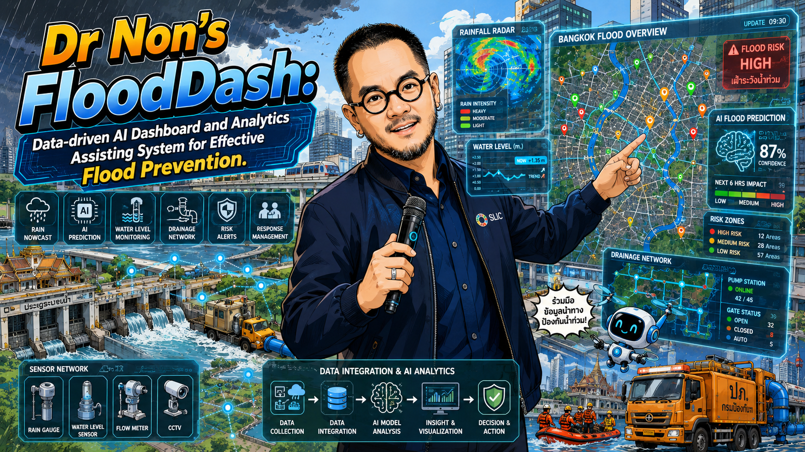

<h1 align="center">FLOODDASH BLUEPRINT</h1>

<b>พิมพ์เขียว ไม่ใช่ซอร์สโค้ด · The blueprint, not the source code.</b>

> **See it live:** [flood.nonarkara.org](https://flood.nonarkara.org) — a real,
> 24/7 flood-monitoring system for Thailand, running on one Mac right now,
> built from the ideas in this repo. **The implementation is private.** What
> you're reading is everything you need to build your own — the data
> sources, the math, the architecture, the design language, and a phased
> roadmap — written so a capable team can reproduce or surpass it without a
> single line of our code.

---

## คำเชิญเปิด / An open invitation

**ภาษาไทย.** ผมสร้าง FloodDash หลังน้ำท่วมหาดใหญ่ปลายปี 2568 เพราะข้อมูลน้ำท่วม
ของไทยทั้งหมด — ระดับน้ำ สสน. ฝนสะสม เขื่อน อ่างเก็บน้ำ คุณภาพอากาศ พยากรณ์ฝน
อัตราการไหลแม่น้ำ ดัชนีมหาสมุทร ข่าวน้ำท่วม — เป็น **ข้อมูลเปิด ฟรี และเครื่องอ่าน
ได้อยู่แล้ว** สิ่งที่ขาดไม่ใช่ข้อมูล แต่คือคนที่จะนั่งเชื่อมมันเข้าด้วยกันให้เป็นภาพเดียว

ผมตั้งใจ **ไม่แจกซอร์สโค้ด** ของเวอร์ชันที่ใช้งานจริงในตอนนี้ — ไม่ใช่เพราะหวง
แต่เพราะอยากรู้ว่า **มีกี่ทีมที่จะสร้างระบบที่ดีเท่ากันหรือดีกว่าได้ด้วยตัวเอง**
โดยเริ่มจากแนวคิดเดียวกัน ข้อมูลเดียวกัน และแรงบันดาลใจเดียวกัน เอกสารนี้บอก
ทุกอย่างที่ต้องรู้: สถาปัตยกรรม สูตรคำนวณ แหล่งข้อมูลทุกจุด ปรัชญาการออกแบบ
และแผนการสร้างทีละขั้น — สิ่งที่ขาดมีแค่เวลาของคุณ

ถ้าคุณสร้างเวอร์ชันของตัวเองได้ — จังหวัด เทศบาล มหาวิทยาลัย บริษัท หรือแค่
มือสมัครเล่นที่อยากช่วยประเทศ — บอกผมด้วย ผมอยากเห็น จะได้ดีใจที่มันได้ผล

**English.** I built FloodDash after the Hat Yai floods of late 2025, because
every piece of flood data Thailand needs — HII water levels, rain
accumulation, dams, reservoirs, air quality, rain forecasts, river discharge,
the ocean's ENSO state, flood news — is **already free, open, and
machine-readable**. The missing piece was never the data. It was someone
willing to sit down and wire it into one coherent picture.

I'm deliberately **not handing out the source code** for the version running
today. Not out of possessiveness — out of curiosity. **I want to know how
many teams can build something this good, or better, on their own**, starting
from the same ideas, the same free data, and the same motivation. This
repository tells you everything else: the architecture, the formulas, every
data source, the design philosophy, and a phased build-your-own roadmap. The
only thing missing is your time.

If you build your own version — a province, a municipality, a university, a
company, or just someone who wants to help the country — tell me. I want to
see it work.

**— Dr Non Arkaraprasertkul** (ดร.นน อัครประเสริฐกุล), Senior Expert, Smart
City Promotion Department, Digital Economy Promotion Agency (depa), Kingdom
of Thailand.

---

## The idea, in one paragraph / แนวคิดในหนึ่งย่อหน้า

**TH.** ระบบเดียวเครื่องเดียว รันได้ตลอด 24 ชั่วโมง ดึงข้อมูลเปิดของรัฐและ
นานาชาติ 9 ท่อ (ระดับน้ำ ฝน เขื่อน อ่างเก็บน้ำ อากาศ พยากรณ์ อัตราการไหลแม่น้ำ
ดัชนีมหาสมุทร ข่าว) เก็บทุกค่าลงฐานข้อมูลเดียว คำนวณ **คะแนนเฝ้าระวังรายจังหวัด**
และ **กราฟต้นน้ำ-ปลายน้ำ** ที่บอกว่าฝนที่ตกบนภูเขาวันนี้จะกลายเป็นน้ำท่วมที่ไหน
ในอีกกี่วัน แสดงผลสองภาษาบนแผนที่เดียว ไม่มีการพยากรณ์ปลอม ไม่มีตัวเลขที่ตรวจ
สอบย้อนกลับไม่ได้ ทุกอย่างมาจากข้อมูลจริง

**EN.** One machine, running 24/7, pulling nine free public data pipelines
(water level, rain, dams, reservoirs, air quality, forecast, river discharge,
ocean state, news) into one database. It computes a **province watch score**
and a **connected-waterways cascade** that tells you how many days it takes
for rain falling on a mountain today to become a flood downstream. Bilingual,
one map, no fabricated forecasts, every number traceable to a real reading.

## Read the blueprint / อ่านพิมพ์เขียว

| # | Document | สรุป | Summary |
|---|----------|------|---------|
| 1 | [`docs/01-why-and-what.md`](docs/01-why-and-what.md) | ที่มา ปัญหา และสมมติฐานตั้งต้น | The origin story, the problem, the founding premise |
| 2 | [`docs/02-architecture.md`](docs/02-architecture.md) | สถาปัตยกรรมระบบแบบเครื่องเดียว | Single-machine system architecture, module by module |
| 3 | [`docs/03-data-sources.md`](docs/03-data-sources.md) | แคตตาล็อกแหล่งข้อมูลฟรีทั้งหมด พร้อมจุดเชื่อมต่อ | The complete catalog of free data sources, with endpoints |
| 4 | [`docs/04-the-science.md`](docs/04-the-science.md) | สูตรคะแนนเฝ้าระวัง กราฟต้นน้ำ-ปลายน้ำ ดัชนีฝนสะสม ENSO | The watch-score formula, the cascade graph, soil wetness, ENSO |
| 5 | [`docs/05-design-language.md`](docs/05-design-language.md) | ปรัชญาการออกแบบสองภาษา ระบบสี ผังหน้าจอ | The bilingual design philosophy, colour system, fixed-viewport UX |
| 6 | [`docs/06-build-your-own-roadmap.md`](docs/06-build-your-own-roadmap.md) | แผนสร้างทีละเฟส ไม่ผูกกับภาษาหรือสแตกใดสแตกหนึ่ง | A phased, stack-agnostic roadmap to build your own |
| 7 | [`docs/07-honest-limitations.md`](docs/07-honest-limitations.md) | ข้อจำกัดที่ต้องพูดตรง ๆ และหลักจริยธรรม | Honest limitations and the ethical framing |

**อยากได้รายละเอียดมากกว่านี้?** ดู **[the deep-dive reference](docs/deep-dive/README.md)**
— เอกสารสังเคราะห์ต้นฉบับสองภาษาแปดฉบับ ครอบคลุมบริบทน้ำท่วมไทยเชิงลึก
แหล่งข้อมูลระดับ endpoint แบบจำลองอุทกวิทยา แมชชีนเลิร์นนิง กรอบการให้คะแนน
ความเสี่ยง ทะเบียนเครื่องมือโอเพนซอร์ส ระบบแจ้งเตือน และเศรษฐศาสตร์แผนงาน —
รวมเนื้อหาความรู้เกือบทั้งหมดที่ใช้สร้าง FloodDash จริง

**Want more depth?** See **[the deep-dive reference](docs/deep-dive/README.md)**
— eight original bilingual synthesis documents covering Thailand's flood
context in forensic detail, endpoint-level data sources, hydrological
models, machine learning, risk-scoring frameworks, the open-source tool
registry, alert systems, and roadmap economics — nearly everything learned
building the real FloodDash, condensed and cited.

## What this repo is **not** / สิ่งที่เอกสารนี้ **ไม่ใช่**

- **ไม่ใช่ซอร์สโค้ด** — ไม่มีไฟล์โปรแกรมสักไฟล์เดียวในนี้ มีแต่แนวคิด สูตร และ
  คู่มือ. **Not source code** — there is not a single program file in this
  repository. Only ideas, formulas, and guides.
- **ไม่ใช่การพยากรณ์น้ำท่วมอย่างเป็นทางการ** — ทั้งพิมพ์เขียวนี้และระบบต้นแบบ
  เป็นเครื่องมือจัดลำดับความสนใจ ไม่ใช่ประกาศเตือนภัย ฟังหน่วยงานทางการเสมอ
  (ปภ. / กรมอุตุฯ / สทนช.). **Not an official flood forecast** — both this
  blueprint and the reference system are attention-prioritisation tools, not
  warning issuers. Always follow official channels (DDPM / TMD / ONWR).
- **ไม่ใช่โปรเจกต์ที่ปิดตาย** — ถ้าคุณสร้างสำเร็จ ส่งลิงก์มา จะเพิ่มไว้ใน
  README นี้ให้. **Not a closed project** — if you build one, send the link;
  it'll be added to this README.

## License / สัญญาอนุญาต

The **ideas, prose, formulas, and diagrams** in this repository are licensed
under **[CC BY 4.0](LICENSE)** — reuse, adapt, translate, and build on them
freely, with attribution. (This licence covers this blueprint's *documents*.
It says nothing about the private reference implementation, which is
separately © Dr Non Arkaraprasertkul, produced under depa and the Smart City
Thailand Office, and not distributed here.)

## Built by / ผู้จัดทำ

**Dr Non Arkaraprasertkul (ดร.นน อัครประเสริฐกุล)** — Senior Expert, Smart
City Promotion Department, **Digital Economy Promotion Agency (depa)**,
Kingdom of Thailand. Produced under the **Smart City Thailand Office**
(สำนักงานเมืองอัจฉริยะประเทศไทย). Contact: `non.ar@depa.or.th` ·
[smartcitythailand.or.th](https://smartcitythailand.or.th)
